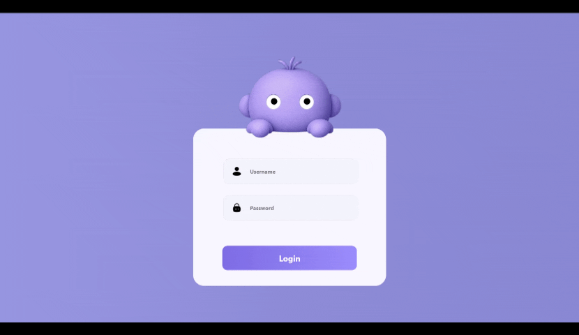

<div align="center">

# 🎮 Easy Login


<br>
<p align="center">
  
</p>
<a href="https://poria-dev.github.io/Easy-_-Login/src/">
    
</a>

<br><br>


<br>


</div>

---

# ✨ About

**Easy Login** is a modern animated login interface built entirely with **Vanilla JavaScript**, **HTML5**, and **Tailwind CSS**.

The character's eyes react dynamically to user interaction, creating a fun and engaging login experience.

This project was created to practice DOM manipulation, animations, positioning, and clean UI design without using any frameworks.

---

# 🌟 Features

- 🎭 Animated Character
- 👀 Interactive Eye Movement
- 🔒 Login Validation
- 🎨 Modern UI Design
- ⚡ Pure JavaScript
- 💨 Tailwind CSS
- ✨ Smooth Animations
- 🧩 Clean Project Structure

---

# 🚀 Live Demo

### 👉 https://poria-dev.github.io/Easy-_-Login/src/

---

# 🛠 Tech Stack

| Technology | Usage |
|------------|-------|
| HTML5 | Structure |
| Tailwind CSS | Styling |
| JavaScript (ES6) | Logic |
| CSS3 | Animations |

---

# 📂 Folder Structure

```text
📦 Easy-Login
│
├── 📂 src
│   ├── index.html
│   ├── game.js
│   ├── output.css
│   └── 📂 login carector
│
└── README.md
```

---

# 📸 Preview

### 🔐 Animated Login Screen

✔ Interactive Eyes

✔ Username Validation

✔ Password Validation

✔ Smooth User Experience

---

# 🎯 What I Learned

- DOM Manipulation
- Event Listeners
- CSS Positioning
- Animations
- Responsive Layout Basics
- Tailwind CSS
- JavaScript Logic

---

# 📌 Future Improvements

- 📱 Fully Responsive Design
- 🌙 Dark Mode
- 🔊 Sound Effects
- 🎵 Background Music
- ✨ Better Animations
- 🎮 More Interactive Components

---

# ⭐ Support

If you like this project,

Please consider giving it a **Star ⭐**

It really motivates me to build more awesome projects.

---

<div align="center">

### Made with ❤️ by Poria

</div>
